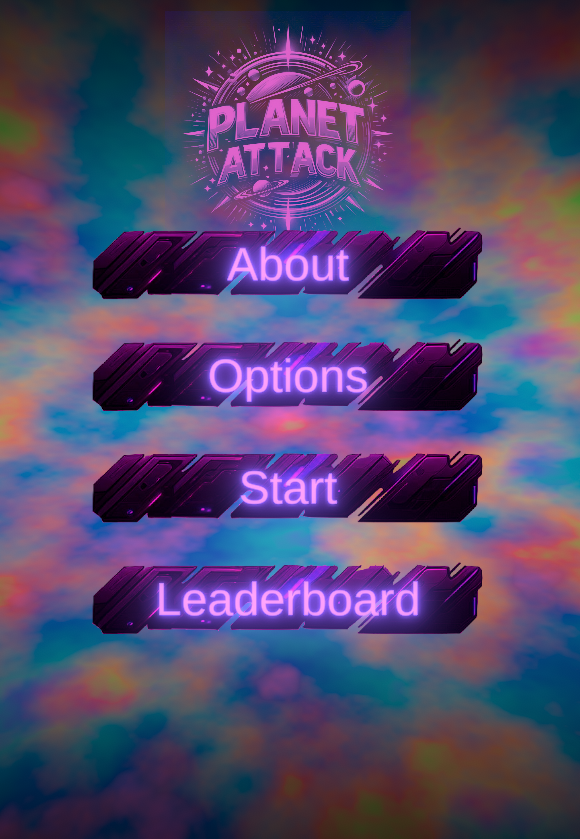

# Planet Attack

**Planet Attack** is a small real-time strategy prototype built in **Unity**.
The goal is simple: **take control of all planets on the map before the enemy does**.

---

## Gameplay

Each planet produces ships over time.
Players can select planets and send ships to attack or reinforce others.
The match ends when one side controls **all planets on the map**.

---

## Gameplay Video

---

## Status

This project is currently a **gameplay prototype**.

---

## Author

Created as a personal Unity project.
